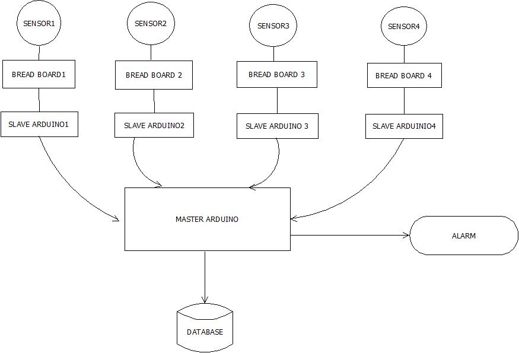
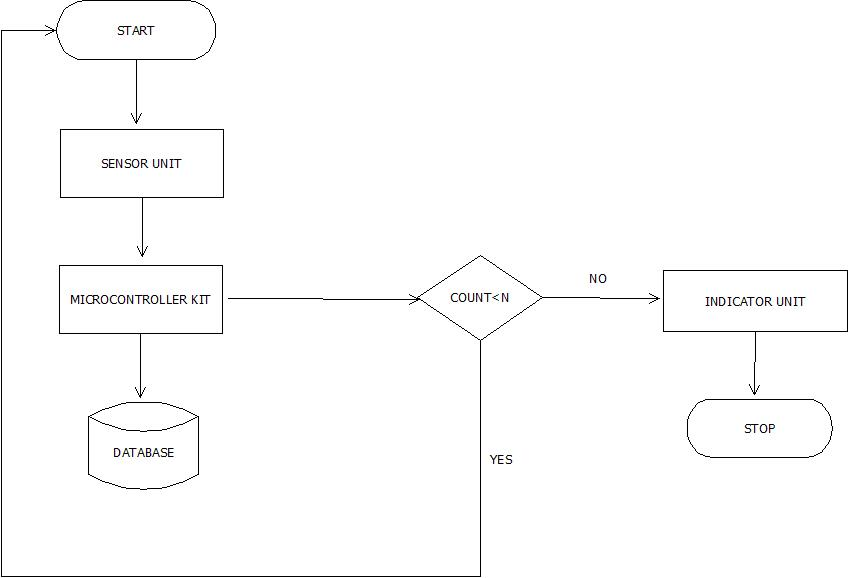
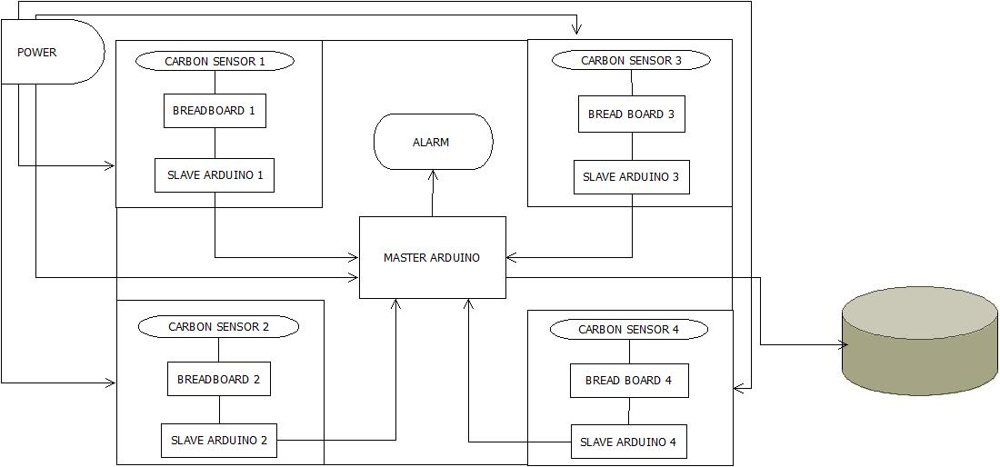
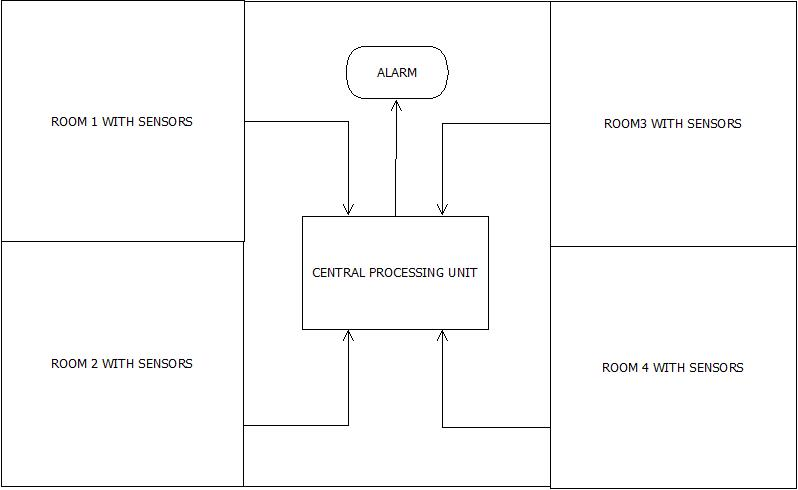

# Occupancy-Counter
  Created by Anuranjan using _Arduino Uno,Carbon dioxide Sensors,Arduino IDE_.

## _What is Occupancy Counter ?_
It is an arduino based system for counting the number of occupants in the room and thereby facilitates proper management using Alarm based triggering.
  
## _Objective_
Occupancy Detector was created to be as simple and straightforward as possible.Availabilty and cost effectiveness was kept in mind while designing this system.However the main objectives are listed below:
- To automate HVAC based on occupancy pattern(less HVAC ,less energy consumption).
- Proper space utilisation.
- Proper disaster management.

## _Components_
- _Hardware_: Arduino UNO, Bread Board, Carbon dioxide Sensors
- _Software_: Arduino IDE

## _Connections_
Whole system revolves around sender-reciever interaction.Sensors are connected to Slave Arduino which takes in data from sensors and send it to Master Arduino for further processing.Master Arduino acts upon the recieved data with appropiate logic and perform specified actions.If we wish we can incorporate Database in upgraded system for storing the intermediate results. 

## _Protocol_
UART (Universal Asysnchronous Reciever-Transmitter) 

## _Flow Chart_

## _System Design_

## _Future Work_

## _Machine Learning and Sensors_
- Occupancy counting using statistic and data.
- Analysing data collected from real world.
- Less device involvement.
- Better accuracy compared to baseline methods.

> # _Keep Smiling And Work Harder_ !!
